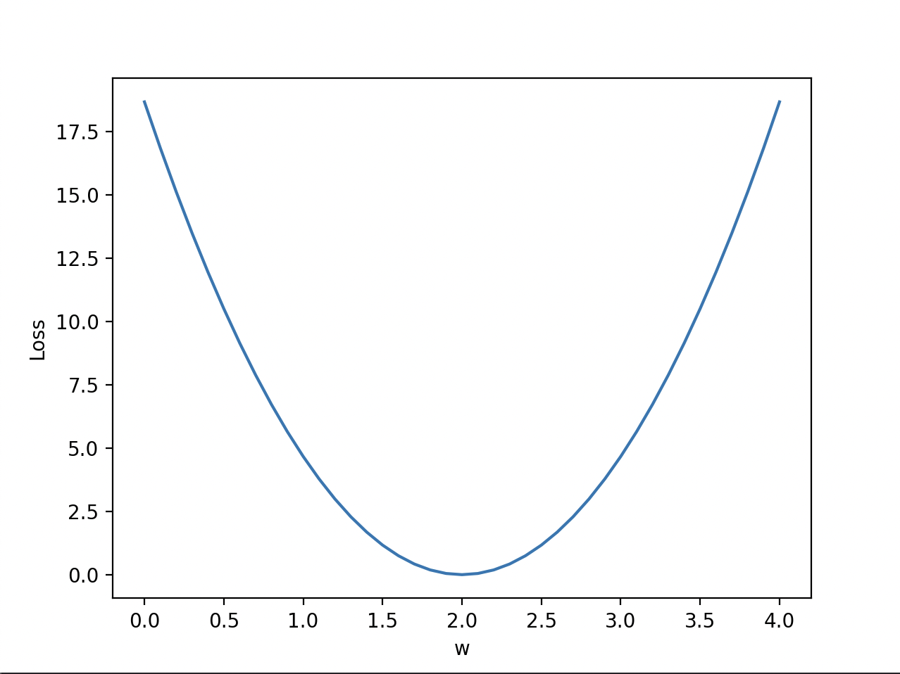

# pytorch

## 线性模型

```py
import numpy as np
import matplotlib.pyplot as plt

# 输入数据
x_data = [1.0, 2.0, 3.0]
y_data = [2.0, 4.0, 6.0]

# 定义前向传播模型
def forward(x):
    return x * w

# 损失函数
def loss(x, y):
    y_pred = forward(x)
    return (y_pred - y) * (y_pred - y)

# 存储每个权重值对应的均方误差（MSE）
w_list = []
mse_list = []

# 遍历不同的权重值
for w in np.arange(0.0, 4.1, 0.1):
    # 打印当前权重值并初始化损失
    print("w=", w)
    l_sum = 0

    # 对于每个输入和输出，计算预测值并计算损失
    for x_val, y_val in zip(x_data, y_data):
        y_pred_val = forward(x_val)
        l = loss(x_val, y_val)
        l_sum += l
        print("\t", x_val, y_val, y_pred_val, l)
    
    # 计算均方误差（MSE）并将权重和MSE添加到列表中
    print("MSE=", l_sum / len(x_data))
    w_list.append(w)
    mse_list.append(l_sum / len(x_data))

# 绘制图表
plt.plot(w_list, mse_list)
plt.ylabel('Loss（损失）')
plt.xlabel('w（权重）')
plt.show()

```



## 梯度下降

```py
# 训练数据
x_data = [1.0, 2.0, 3.0]
y_data = [2.0, 4.0, 6.0]

w = 1.0  # 初始权重值，随机猜测的值

# 定义前向传播模型
def forward(x):
    return x * w

# 损失函数
def loss(x, y):
    y_pred = forward(x)
    return (y_pred - y) * (y_pred - y)

# 计算梯度
def gradient(x, y):  # 损失对权重的偏导数，即 d_loss/d_w
    return 2 * x * (x * w - y)

# 训练前的预测
print("预测（训练前）",  4, forward(4))

# 训练循环
for epoch in range(10):
    for x_val, y_val in zip(x_data, y_data):
        # 计算损失对权重的梯度
        # 更新权重
        # 计算损失并打印进度
        grad = gradient(x_val, y_val)
        w = w - 0.01 * grad
        print("\t梯度: ", x_val, y_val, round(grad, 2))
        l = loss(x_val, y_val)
    print("进度:", epoch, "w=", round(w, 2), "损失=", round(l, 2))

# 训练后的预测
print("预测得分（训练后）",  "学习4小时的预测: ", forward(4))

```

## 反向传播

```py
import torch
import pdb

# 训练数据
x_data = [1.0, 2.0, 3.0]
y_data = [2.0, 4.0, 6.0]

# 初始化权重并设置 requires_grad 为 True，以便进行梯度计算
w = torch.tensor([1.0], requires_grad=True)

# 定义前向传播模型
def forward(x):
    return x * w

# 损失函数
def loss(y_pred, y_val):
    return (y_pred - y_val) ** 2

# 训练前的预测
print("预测（训练前）",  4, forward(4).item())

# 训练循环
for epoch in range(10):
    for x_val, y_val in zip(x_data, y_data):
        y_pred = forward(x_val)  # 1) 前向传播
        l = loss(y_pred, y_val)  # 2) 计算损失
        l.backward()  # 3) 反向传播更新权重梯度
        print("\t梯度: ", x_val, y_val, w.grad.item())
        w.data = w.data - 0.01 * w.grad.item()

        # 在更新权重后手动将梯度清零
        w.grad.data.zero_()

    print(f"Epoch: {epoch} | Loss: {l.item()}")

# 训练后的预测
print("预测（训练后）",  4, forward(4).item())

```

## torch cnn

```py
from torch import nn
import torch
from torch import tensor

# 训练数据
x_data = tensor([[1.0], [2.0], [3.0]])
y_data = tensor([[2.0], [4.0], [6.0]])

# 定义线性回归模型
class Model(nn.Module):
    def __init__(self):
        super(Model, self).__init__()
        # 定义一个线性层，输入维度为1，输出维度为1
        self.linear = torch.nn.Linear(1, 1)

    def forward(self, x):
        # 前向传播
        y_pred = self.linear(x)
        return y_pred

# 实例化模型
model = Model()

# 定义损失函数和优化器
criterion = torch.nn.MSELoss(reduction='sum')  # 平方误差损失
optimizer = torch.optim.SGD(model.parameters(), lr=0.01)  # 随机梯度下降优化器

# 训练循环
for epoch in range(500):
    # 1) 前向传播：通过模型传递输入 x 得到预测值 y_pred
    y_pred = model(x_data)

    # 2) 计算并打印损失
    loss = criterion(y_pred, y_data)
    print(f'Epoch: {epoch} | Loss: {loss.item()} ')

    # 清零梯度，进行反向传播，更新权重
    optimizer.zero_grad()
    loss.backward()
    optimizer.step()

# 训练后的预测
hour_var = tensor([[4.0]])
y_pred = model(hour_var)
print("预测（训练后）",  4, model(hour_var).data[0][0].item())
```

## 二元分类

```py
from torch import tensor
from torch import nn
from torch import sigmoid
import torch.optim as optim

# 训练数据和标签
x_data = tensor([[1.0], [2.0], [3.0], [4.0]])
y_data = tensor([[0.], [0.], [1.], [1.]])

# 定义二元分类模型
class Model(nn.Module):
    def __init__(self):
        super(Model, self).__init__()
        self.linear = nn.Linear(1, 1)  # 输入一维，输出一维

    def forward(self, x):
        y_pred = sigmoid(self.linear(x))
        return y_pred

# 实例化模型
model = Model()

# 定义损失函数和优化器
criterion = nn.BCELoss(reduction='mean')  # 二元交叉熵损失
optimizer = optim.SGD(model.parameters(), lr=0.01)

# 训练循环
for epoch in range(1000):
    # 前向传播：通过模型传递输入 x 得到预测值 y_pred
    y_pred = model(x_data)

    # 计算并打印损失
    loss = criterion(y_pred, y_data)
    print(f'Epoch {epoch + 1}/1000 | Loss: {loss.item():.4f}')

    # 清零梯度，进行反向传播，更新权重
    optimizer.zero_grad()
    loss.backward()
    optimizer.step()

# 训练后的预测
print(f'\n预测在达到50%以上所需的小时数\n{"=" * 50}')
hour_var = model(tensor([[1.0]]))
print(f'1小时训练后的预测: {hour_var.item():.4f} | 是否超过50%: {hour_var.item() > 0.5}')
hour_var = model(tensor([[7.0]]))
print(f'7小时训练后的预测: {hour_var.item():.4f} | 是否超过50%: { hour_var.item() > 0.5}')
```

